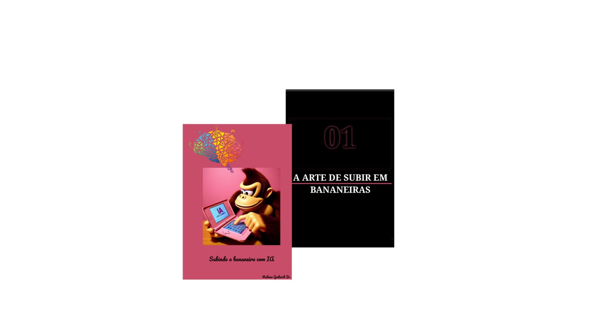

    

-------

# Projeto EBOOK Gerado por I.A.s

 > ℹ️ **NOTE:** Este é o repositório desenvolvido durante o curso no qual fui aluno na plataforma da [DIO](https://dio.me)

Projeto com o objetivo de gerar um ebook digital com as facilidades das ferramentas de IA. todos os prompts
seguem abaixo.

<a href="https://github.com/rubensguilardijr/prompts-recipe-to-create-a-ebook/blob/main/output/Subindo%20a%20bananeira%20com%20IA.pdf" title="View PDF now"> 📕Clique aqui para ler</a>

## 💻 Tecnologias utilizadas no projeto

- [ChatGPT](https://chat.openai.com/) 
- [COPILOT Designer](https://copilot.microsoft.com/images/create)
- [Google Slides](https://docs.google.com/presentation)

## 🧠 Prompts

ChatGPT：

|   Ação   | prompt                                                                                                                                                                                                                                                                         |
| :------: | ------------------------------------------------------------------------------------------------------------------------------------------------------------------------------------------------------------------------------------------------------------------------------ |
|  título  | Crie um titulo de um ebook sobre o tema de subir em bananeiras, o ebook com nicho de bananas, o titulo deve ser epico e curto, com uma tematica mais arte/video games, me liste 5 variacoes                                                        |
| conteúdo | Faca um texto para ebook, com foco em subir em bananeiras, listando os principais tipos de bananas com exemplos REGRAS Explique sempre de uma maneira simples Deixe o texto enxuto Sempre traga exemplos e ilustracoes em contextos reais Crie um nome |

Copilots

|  Ação  | prompt                                                                                 |
| :----: | -------------------------------------------------------------------------------------- |
| título | Make an image of donkey kong using IA in his nindento ds in his house, his nintendo ds is pink, last games style. --v 5.1 |

## ✨ Features

- Conteúdo gerado via ChatGPT
- Imagens geradas via Copilot

## 📚 Materiais

- Imagens utilizadas em `assets`
- ebook gerado durante as aulas em `output`

## 🛠️ Instruções de execução

Utilize os prompts acima nas ferramentas sugeridas para gerar o material base e utilize uma ferramenta de edição de documentos como power point, libreoffice , indesign para diagramação.

## 👨‍💻 Prompiteiro

    
&nbsp&nbsp&nbspRubens G. Jr. 
    &nbsp&nbsp&nbsp
    <a href="https://github.com/">
    GitHub</a>&nbsp;|&nbsp;
    <a href="www.linkedin.com/in/
rubens-guilardi-junior">LinkedIn</a>
&nbsp;|&nbsp;
&nbsp;|&nbsp;

  

---

⌨️ com A.I. por [Rubens Jr.](https://github.com/rubensguilardijr)
